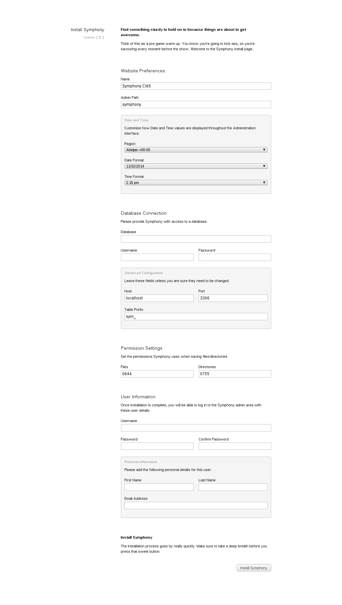
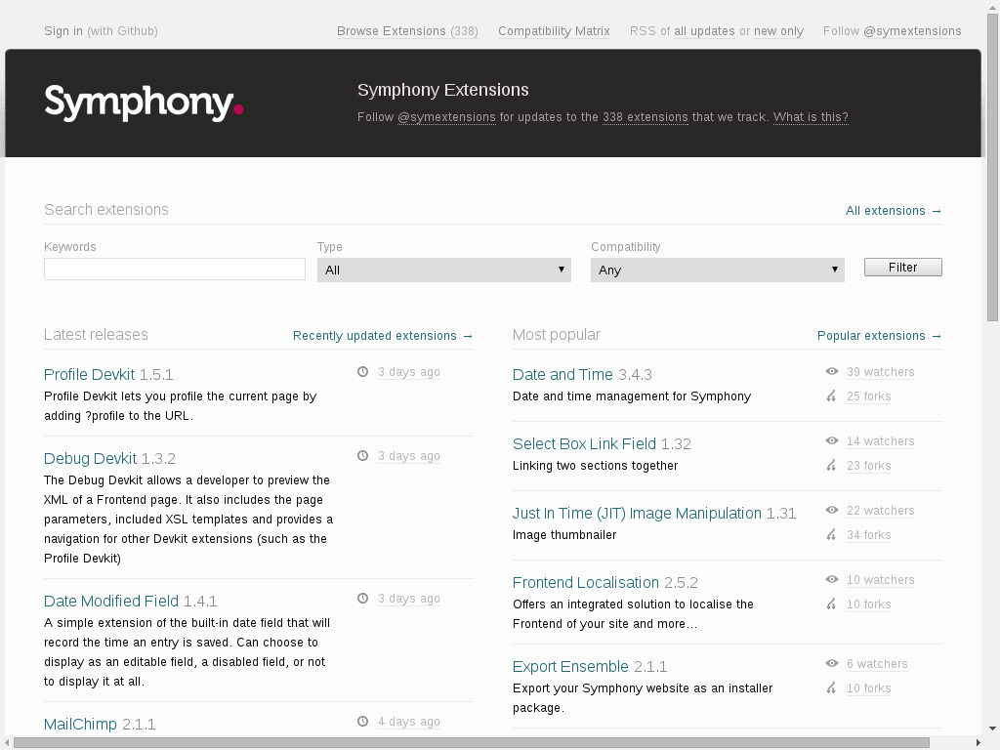
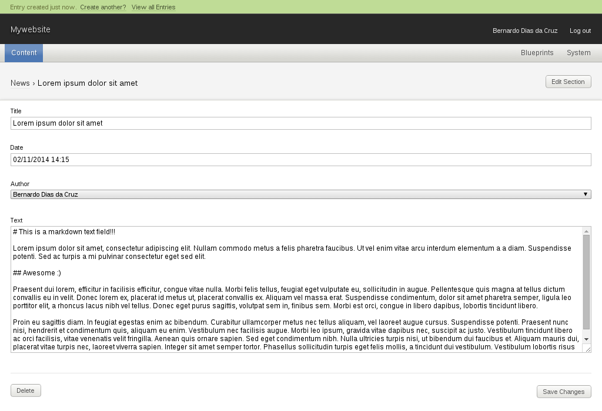
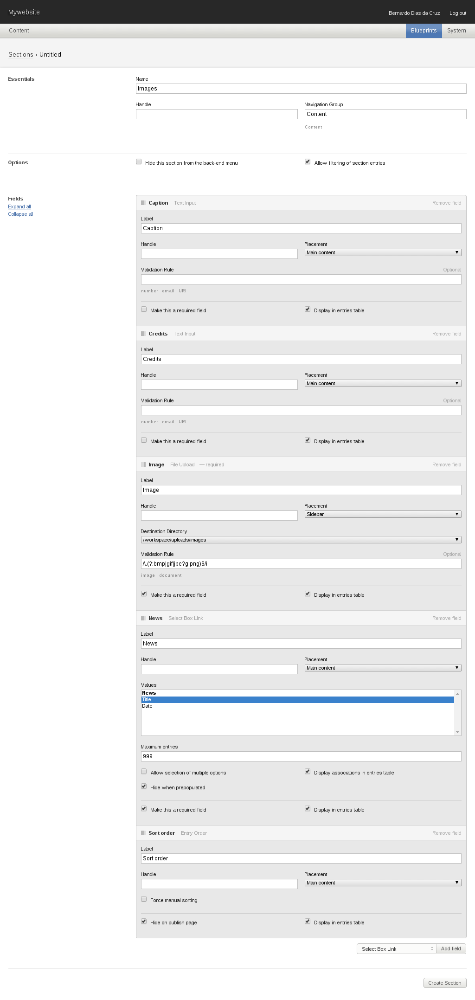
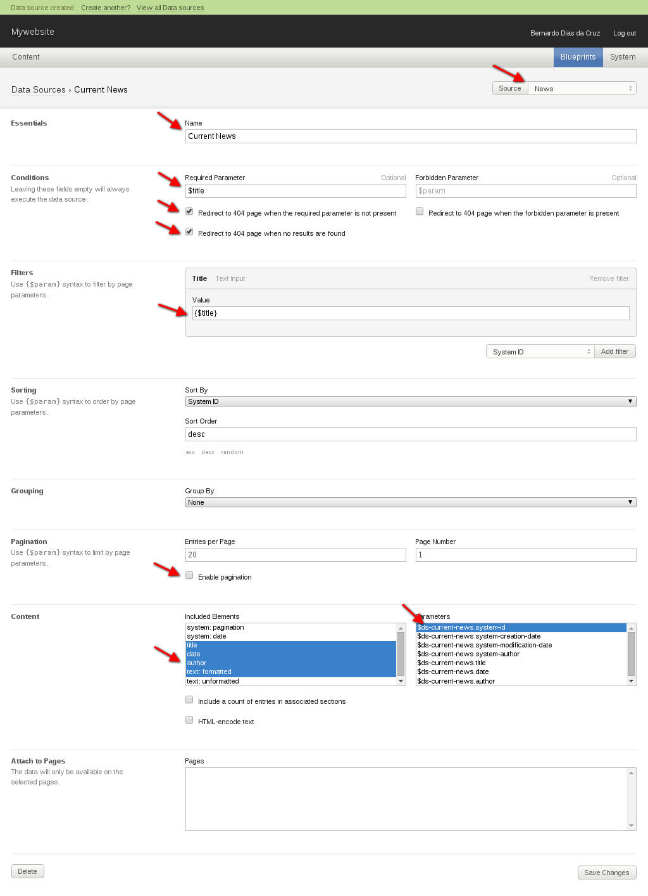
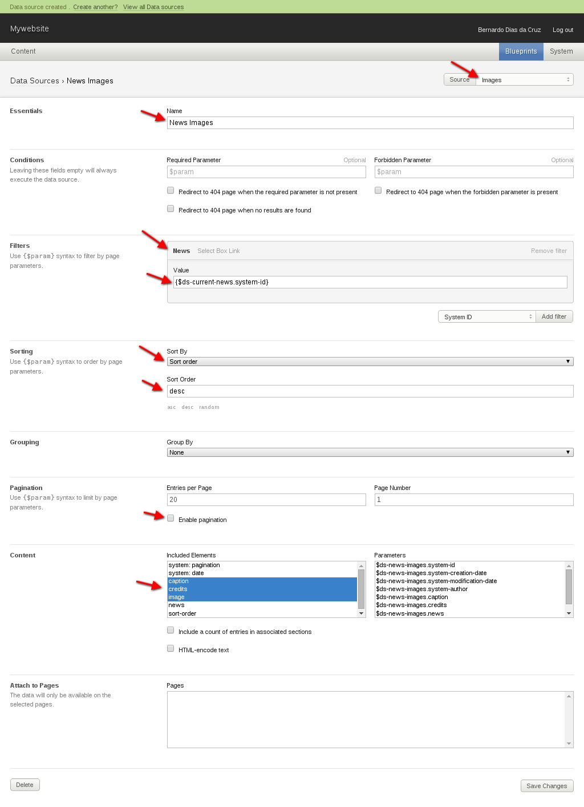
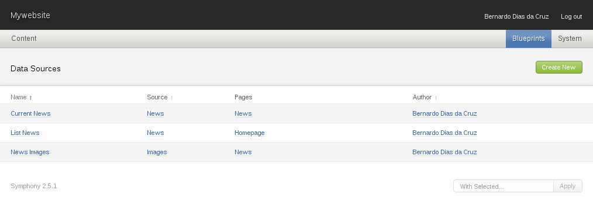
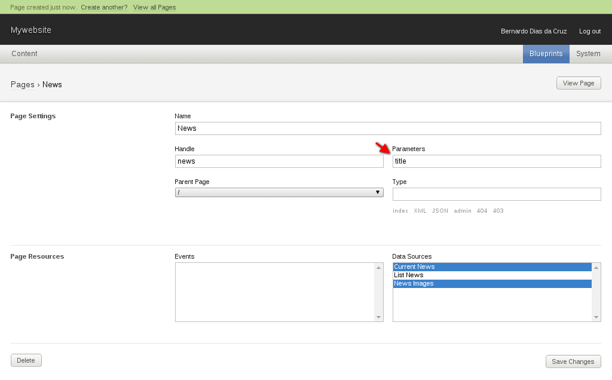
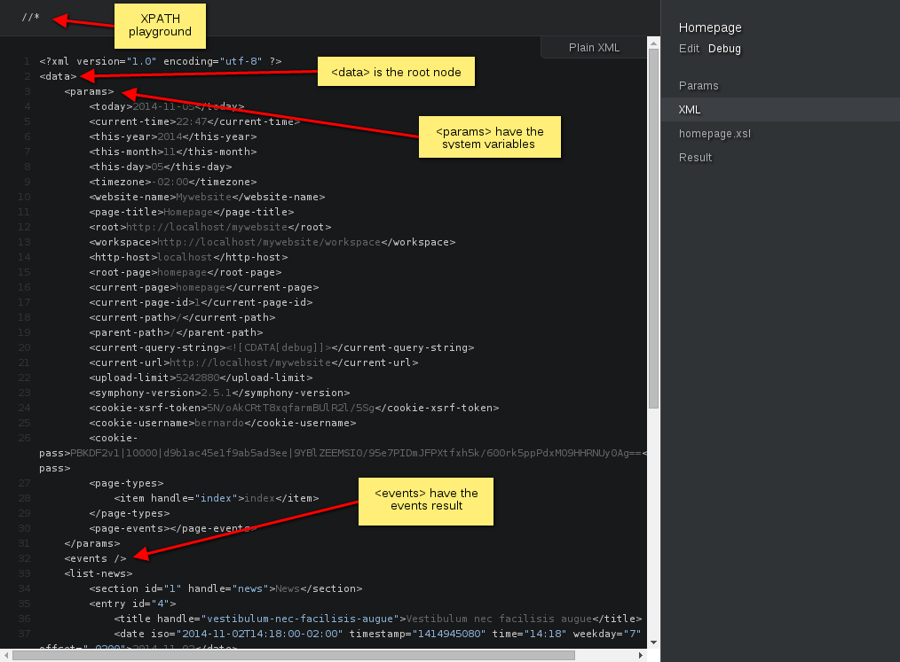
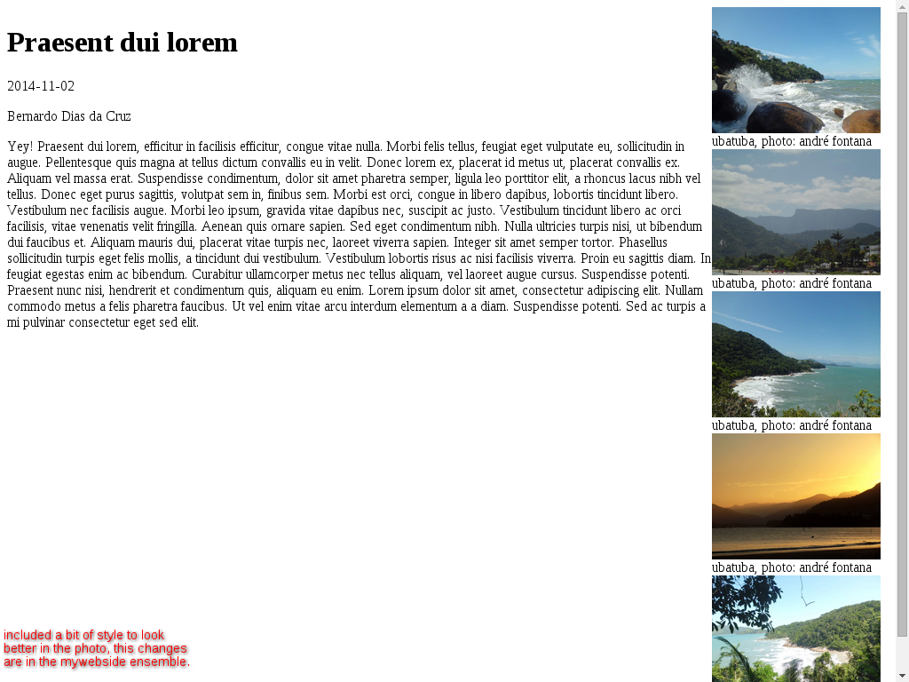

Symphony CMS 2.x.x Tutorial
=====

In this tutorial we'll build a fully administrable website from scratch with [Symphony CMS](http://www.getsymphony.com/).

__getsymphony.com__


Created by Allen Chang and Alistair Kearney for over a decade, Symphony is an Open Source XSLT-based CMS built in PHP and MySQL. But don't worry about programming languages yet, this CMS is very accessible even for designers. We'll focus our attention on the amazing concept of this tool and how easy and quick you can build an entire website with, wait for it, full control of your frontend.

> Symphony's features strike a perfect balance: the power to do everything you need, the intelligence to do only what you need.

_Before we start, make sure you understand that this is NOT a Symfony PHP Framework tutorial. Not even close. Ready?_ :)

So lets get started!


01. Setup enviroment
-----

To build with Symphony you'll need to make sure your server requirements match the following:

- PHP 5.3 or above
- PHP's LibXML module, with the XSLT extension enabled (--with-xsl)
- MySQL 5.0 or above
- An Apache webserver (can be used with others, but we'll focus on Apache server in this tutorial)
- Apache's mod_rewrite module or equivalent


02. Symphony CMS install
-----

Install Symphony is very easy. Can be done even in old-fashioned way with .zip files. We'll do, of course, in the cool way, with Git.

### I. Git clone

First step, go to [github.com/symphonycms/symphony-2](http://github.com/symphonycms/symphony-2) and clone the project in your server.


`git clone --depth=1 https://github.com/symphonycms/symphony-2.git mywebsite`

With the system files cloned, now open the project in your browser [http://localhost/mywebsite/](http://localhost/mywebsite/).

_We'll not use virtual hosts on this tutorial to keep it simple, so consider `http://localhost` as your Apache server root of public files, `/mywebsite` will be located there._

### II. Install wizard

In the __mywebsite__ URL you'll see the install wizard, this page is pretty informative, go on, fill up the fields and click `Install Symphony`. Ah, you'll need a DB for this project, make sure you have created one with the MySQL tool of your choice.



### III. Done!

All setup, ready to go!


03. Symphony administration
-----

### I. Login

Now go to your administration page, in this tutorial we'll use the default `/symphony` path, but as you saw in the wizard, you can choose any different path.


### II. Administration page

After login you'll see a pretty and clear administration page.


In Symphony we have some very well defined concepts to create the awesomeness. I'll explain the basics, but you can read more in the official Symphony website [concepts](http://www.getsymphony.com/learn/concepts/).

The developer tools are in these two sections on the right side of the main menu: __Blueprints__ and __System__. At this moment we really dont have any kind of content structure or pages. Like a blank piece of paper, we'll build based only on our project specification, and this is one big differential comparing to others CMSes.

```
- Blueprints
  - Pages
  - Sections
  - Data Sources
  - Events
- System
  - Authors
  - Preferences
  - Extensions
```

From Symphony [learn](http://www.getsymphony.com/learn/) page, the following infographic explains a lot of how Symphony works!


### III. Symphony Extensions

It's important to understand that Symphony are meant to be simple, and have a powerfull core to be extended by the community. For this we have tons of extensions for any kind of need. The core install have the basics, which is enough to do the basic, but for our tutorial we'll go further. We'll install extensions on demand as the tutorial evolves.

The official repository of extensions can be found in the [extensions](http://www.getsymphony.com/download/extensions/) section in Symphony website. While the official website is great and full of resources, few years ago [@nickdunn](http://twitter.com/nickdunn) buit a better extension repository named [symphonyextensions.com](http://symphonyextensions.com/), we'll use this one in this tutorial.



### IV. Files Structure

```
TBP!!!
├── bar.txt
├── foo.txt
└── my-folder
    └── baz.txt
```


04. Mywebsite backend
-----

It's time to have some fun. First of all we need to understand what we are doing. Lets imagine a very simple news website, the content structure should look like this:

```
- News
  - Title (one line text field)
  - Date (datetime field)
  - Text (textarea with markdown)
  - Author (author from the admin)
  - Images (gallery of images)
```

### I. Working with Sections

#### a) Creating the News Section

Go to `Blueprints > Sections > Create new` and create the __News__ section as the following:


At this moment we are not using any extension, so we just created the basic fields for the __News section__.

Now we need the Markdown formatter for the __Text field__, on your terminal, in the project root, run:

`git submodule add https://github.com/symphonycms/markdown.git extensions/markdown --recursive`

_(more information about this extension here: [Markdown Text Formatter](http://symphonyextensions.com/extensions/markdown/))_

Back to the administration go to `System > Extensions`, select `Markdown Text Formatter` and in the bottom right selectbox, choose `Install` then click `Apply`.


Go back to `Blueprints > Sections`, click on `News` and set the `Text Formatter` on the __Text field__ to `Markdown` and `Save changes`.


#### b) Filling News section with sample content

At this moment you already see the newly created section in the left side on main menu. To proceed in the development of this tutorial we'll create some content in that section.

Go to `Content > News`, you'll see an empty list of entries. That's fine, click on the green button `Create New`.


The greatest thing of Symphony is the administration interface, it's really simple!



After creating a few entries with sample content, you'll be able to see the entries list and sort as you want. What you see here is unrelated to frontend, as we'll see soon.


#### c) Creating the Images Section (linked sections)

You probably noticed that I didn't included any image field in the __News section__. If yes, cool, you are paying attention :)

So lets create a new section called __Images__, with some meta information like __caption__ and __credits__. But first we need to create a new folder to upload all image files of this section. On your terminal run `mkdir workspace/uploads && mkdir workspace/uploads/images`.

For this section we'll need 2 more extensions, to install, run:

`git submodule add https://github.com/symphonycms/selectbox_link_field.git extensions/selectbox_link_field --recursive`

_(more information at [Selectbox Link Field](http://symphonyextensions.com/extensions/selectbox_link_field/))_

`git submodule add https://github.com/symphonists/order_entries.git extensions/order_entries --recursive`

_(more information at [Order Entries](http://symphonyextensions.com/extensions/order_entries/))_

Now go to `System > Extensions` and install both. The __Selectbox Link Field__ will provide a new kind of field that is used to link one section to another. The __Order Entries__ is also a new field type to allow user sort entries by dragging the lines in the entries list.


Now go to `Blueprints > Sections` and `Create New` section as the following:



After create the __Images sections__, go to `Content > News` and spot the new column called `Images` on the right side. Click on the `0 →` link of any entry to create sample content linked to that entry.


#### d) Filling Images section with sample content

Create content is something really simple, as we saw before. No big deal here too.

After creating some sample content, you'll be able to see in the __News Section__ entries list, in the __Images__ column something like `5 →` and when you click in this link you'll go to __Image Section__ entries list, but filtered only with related entries.


### II. Working with Data Sources

So far so good! At this point we already have a complete administration interface for CRUD/BREAD stuff. Now we'll jump in Data Sources!

Data Sources are filters to fetch entries from sections on demand. To create a new Data Source go to `Blueprints > Data Sources > Create New`.

For this example we need to know what we want in the frontend (getting there!). So, lets imagine the following specs: In the homepage of __mywebsite__ I want to see a list of all news with links for the news page. In the list, news should be sorted by date desc with date and title. In the news page I want to see all data of that news.

To accomplish this we'll need a few Data Sources, go to `Blueprints > Data Sources > Create New` and create the following:

- List News (fetch all News, sorted by date desc)
- Current News (fetch only the current news)
- News Images (fetch all images of the current news, sorted by sord order field desc)

#### a) List News

Select source __News__, sort by date desc, disable pagination to fetch all entries, select only title and date fields to output.


#### b) Current News

Select source __News__, set condition with required param `$title`, if this condition return false, redirect to a 404 page. Filter by the __Title field__ with `$title` param. Disable pagination to fetch all entries, select only title, date, author and text (formatted) to output. Also output `$ds-current-news.system-id` param with the results.

_We'll see where `$title` param come from in the next topic!_



#### c) News Images

Select source __Images__, Filter by the __News field__ (the Selectbox link field) with the `$ds-current-news.system-id` param from the __Current News__ Data Source, this is called chaining datasources. Sort by __Sord order field__ desc, disable pagination to fetch all entries, select only caption, credits and image fields to output.



#### d) List of Data Sources

So, this is the `Blueprints > Data Sources` now.



### III. Working with Pages

Now it's time to create the routes and attach data sources. Following the specs we'll have two pages: __Homepage__ and __News__.

#### a) Homepage

Lets create the __Homepage__, this page is the only one with __Type__ `index`. To do this, go to `Blueprints > Pages`. While creating we'll also attach __List News__ Data Source on this page.


#### b) News

When creating the __News page__ we'll define the __Parameters__ with `title` value, this param is the `$title` used in the __Current News__ Data Source. We'll also attach __Current News__ and __News Images__ Data Sources in this page.



#### c) List of Pages

So, this is the `Blueprints > Pages` now.


05. Mywebsite frontend
-----

Here we are, lets start our frontend!

Symphony works with XML to transport all data retrieved by the Data Sources and transform in HTMl using XSLT. XSLT is a template engine language very easy to learn, I'll show you the basics.

First thing we need now is install the [Debug Devkit](http://symphonyextensions.com/extensions/debugdevkit/) extensions to see behing the hood of the pages.

`git submodule add https://github.com/symphonycms/debugdevkit.git extensions/debugdevkit --recursive`

### I. Homepage

Now open your homepage [`http://localhost/mywebsite`](http://localhost/mywebsite)!

You'll see a blank page just an `<h1>` with the page title, that's perfect. Open the `/workspace/pages/homepage.xsl`, you'll see the following:

#### a) Default homepage.xsl

```xml
<?xml version="1.0" encoding="UTF-8"?>
<xsl:stylesheet version="1.0"
  xmlns:xsl="http://www.w3.org/1999/XSL/Transform">

<xsl:output method="xml"
  doctype-public="-//W3C//DTD XHTML 1.0 Strict//EN"
  doctype-system="http://www.w3.org/TR/xhtml1/DTD/xhtml1-strict.dtd"
  omit-xml-declaration="yes"
  encoding="UTF-8"
  indent="yes" />

<xsl:template match="/">
  <h1><xsl:value-of select="/data/params/page-title"/></h1>
</xsl:template>

</xsl:stylesheet>
```

#### b) Homepage ?debug

Now open the debug devkit adding `?debug` in the URL [`http://localhost/mywebsite/?debug`](http://localhost/mywebsite/?debug), and in the XML tab you'll see the following:

```xml
<?xml version="1.0" encoding="utf-8" ?>
<data>
    <params>
        <today>2014-11-05</today>
        <current-time>22:47</current-time>
        <this-year>2014</this-year>
        <this-month>11</this-month>
        <this-day>05</this-day>
        <timezone>-02:00</timezone>
        <website-name>Mywebsite</website-name>
        <page-title>Homepage</page-title>
        <root>http://localhost/mywebsite</root>
        <workspace>http://localhost/mywebsite/workspace</workspace>
        <http-host>localhost</http-host>
        <root-page>homepage</root-page>
        <current-page>homepage</current-page>
        <current-page-id>1</current-page-id>
        <current-path>/</current-path>
        <parent-path>/</parent-path>
        <current-query-string><![CDATA[debug]]></current-query-string>
        <current-url>http://localhost/mywebsite</current-url>
        <upload-limit>5242880</upload-limit>
        <symphony-version>2.5.1</symphony-version>
        <cookie-xsrf-token>5N/oAkCRtT8xqfarmBUlR2l/5Sg</cookie-xsrf-token>
        <cookie-username>bernardo</cookie-username>
        <cookie-pass>PBKDF2v1|10000|d9b1ac45e1f9ab5ad3ee|9YBlZEEMSI0/95e7PIDmJFPXtfxh5k/600rk5ppPdxMO9HHRNUy0Ag==</cookie-pass>
        <page-types>
            <item handle="index">index</item>
        </page-types>
        <page-events></page-events>
    </params>
    <events />
    <list-news>
        <section id="1" handle="news">News</section>
        <entry id="4">
            <title handle="vestibulum-nec-facilisis-augue">Vestibulum nec facilisis augue</title>
            <date iso="2014-11-02T14:18:00-02:00" timestamp="1414945080" time="14:18" weekday="7" offset="-0200">2014-11-02</date>
        </entry>
        <entry id="5">
            <title handle="praesent-dui-lorem">Praesent dui lorem</title>
            <date iso="2014-11-02T14:18:00-02:00" timestamp="1414945080" time="14:18" weekday="7" offset="-0200">2014-11-02</date>
        </entry>
        <entry id="2">
            <title handle="proin-eu-sagittis-diam">Proin eu sagittis diam</title>
            <date iso="2014-11-02T14:17:00-02:00" timestamp="1414945020" time="14:17" weekday="7" offset="-0200">2014-11-02</date>
        </entry>
        <entry id="3">
            <title handle="nullam-commodo-metus-a-felis-pharetra-faucibus">Nullam commodo metus a felis pharetra faucibus</title>
            <date iso="2014-11-02T14:17:00-02:00" timestamp="1414945020" time="14:17" weekday="7" offset="-0200">2014-11-02</date>
        </entry>
        <entry id="1">
            <title handle="lorem-ipsum-dolor-sit-amet">Lorem ipsum dolor sit amet</title>
            <date iso="2014-11-02T14:15:00-02:00" timestamp="1414944900" time="14:15" weekday="7" offset="-0200">2014-11-02</date>
        </entry>
    </list-news>
</data>
```



#### c) Edited homepage.xsl

What matter here is the `<list-news>` node, which is the result of the [List News](#a-list-news) Data Source. Now we'll make a list with this data using __XPath__ in the `/workspace/pages/homepage.xsl`, and the file will look like this:

```xml
<?xml version="1.0" encoding="UTF-8"?>
<xsl:stylesheet version="1.0"
  xmlns:xsl="http://www.w3.org/1999/XSL/Transform">

<xsl:output method="xml"
  doctype-public="-//W3C//DTD XHTML 1.0 Strict//EN"
  doctype-system="http://www.w3.org/TR/xhtml1/DTD/xhtml1-strict.dtd"
  omit-xml-declaration="yes"
  encoding="UTF-8"
  indent="yes" />

<xsl:template match="/">
  <ul>
    <xsl:for-each select="data/list-news/entry">
      <li>
        <a href="{/data/params/root}/news/{title/@handle}"><xsl:value-of select="title"/></a>
      </li>
    </xsl:for-each>
  </ul>
</xsl:template>

</xsl:stylesheet>
```

#### c) Homepage output

And the HTML output will be:

```html
<!DOCTYPE ul PUBLIC "-//W3C//DTD XHTML 1.0 Strict//EN" "http://www.w3.org/TR/xhtml1/DTD/xhtml1-strict.dtd">
<ul>
  <li>
    <a href="http://localhost/mywebsite/news/vestibulum-nec-facilisis-augue">Vestibulum nec facilisis augue</a>
  </li>
  <li>
    <a href="http://localhost/mywebsite/news/praesent-dui-lorem">Praesent dui lorem</a>
  </li>
  <li>
    <a href="http://localhost/mywebsite/news/proin-eu-sagittis-diam">Proin eu sagittis diam</a>
  </li>
  <li>
    <a href="http://localhost/mywebsite/news/nullam-commodo-metus-a-felis-pharetra-faucibus">Nullam commodo metus a felis pharetra faucibus</a>
  </li>
  <li>
    <a href="http://localhost/mywebsite/news/lorem-ipsum-dolor-sit-amet">Lorem ipsum dolor sit amet</a>
  </li>
</ul>
```


### II. News page

When click on any link you go to the __News__ page, which is the file `/workspace/pages/news.xsl`. First lets see what XML we have attached in this page, click on any link and add `?debug` in the URL [`http://localhost/mywebsite/news/vestibulum-nec-facilisis-augue/?debug`](http://localhost/mywebsite/news/vestibulum-nec-facilisis-augue/?debug):

#### a) News page ?debug

```xml
<?xml version="1.0" encoding="utf-8" ?>
<data>
    <params>
        <today>2014-11-05</today>
        <current-time>23:24</current-time>
        <this-year>2014</this-year>
        <this-month>11</this-month>
        <this-day>05</this-day>
        <timezone>-02:00</timezone>
        <website-name>Mywebsite</website-name>
        <page-title>News</page-title>
        <root>http://localhost/mywebsite</root>
        <workspace>http://localhost/mywebsite/workspace</workspace>
        <http-host>localhost</http-host>
        <root-page>news</root-page>
        <current-page>news</current-page>
        <current-page-id>2</current-page-id>
        <current-path>/news/praesent-dui-lorem</current-path>
        <parent-path>/</parent-path>
        <current-query-string><![CDATA[debug]]></current-query-string>
        <current-url>http://localhost/mywebsite/news/praesent-dui-lorem</current-url>
        <upload-limit>5242880</upload-limit>
        <symphony-version>2.5.1</symphony-version>
        <title>praesent-dui-lorem</title>
        <cookie-xsrf-token>5N/oAkCRtT8xqfarmBUlR2l/5Sg</cookie-xsrf-token>
        <cookie-username>bernardo</cookie-username>
        <cookie-pass>PBKDF2v1|10000|d9b1ac45e1f9ab5ad3ee|9YBlZEEMSI0/95e7PIDmJFPXtfxh5k/600rk5ppPdxMO9HHRNUy0Ag==</cookie-pass>
        <page-types />
        <page-events></page-events>
        <ds-current-news.system-id>
            <item handle="5">5</item>
        </ds-current-news.system-id>
        <ds-current-news>
            <item handle="5">5</item>
        </ds-current-news>
    </params>
    <events />
    <current-news>
        <section id="1" handle="news">News</section>
        <entry id="5">
            <title handle="praesent-dui-lorem">Praesent dui lorem</title>
            <date iso="2014-11-02T14:18:00-02:00" timestamp="1414945080" time="14:18" weekday="7" offset="-0200">2014-11-02</date>
            <author>
                <item id="1" handle="bernardo-dias-da-cruz" username="bernardo">Bernardo Dias da Cruz</item>
            </author>
            <text mode="formatted">
                <h1>Yey!</h1>
                <p><strong>Praesent dui lorem</strong>, efficitur in facilisis efficitur, congue vitae nulla. Morbi felis tellus, feugiat eget vulputate eu, sollicitudin in augue. Pellentesque quis magna at tellus dictum convallis eu in velit. Donec lorem ex, placerat id metus ut, placerat convallis ex. Aliquam vel massa erat. Suspendisse condimentum, dolor sit amet pharetra semper, ligula leo porttitor elit, a rhoncus lacus nibh vel tellus. Donec eget purus sagittis, volutpat sem in, finibus sem. Morbi est orci, congue in libero dapibus, lobortis tincidunt libero.</p>
                <p>Vestibulum nec facilisis augue. Morbi leo ipsum, gravida vitae dapibus nec, suscipit ac justo. Vestibulum tincidunt libero ac orci facilisis, vitae venenatis velit fringilla. Aenean quis ornare sapien. Sed eget condimentum nibh. Nulla ultricies turpis nisi, ut bibendum dui faucibus et. Aliquam mauris dui, placerat vitae turpis nec, laoreet viverra sapien. Integer sit amet semper tortor. Phasellus sollicitudin turpis eget felis mollis, a tincidunt dui vestibulum. Vestibulum lobortis risus ac nisi facilisis viverra.</p>
                <p>Proin eu sagittis diam. In feugiat egestas enim ac bibendum. Curabitur ullamcorper metus nec tellus aliquam, vel laoreet augue cursus. Suspendisse potenti. Praesent nunc nisi, hendrerit et condimentum quis, aliquam eu enim.</p>
                <p>Lorem ipsum dolor sit amet, consectetur adipiscing elit. Nullam commodo metus a felis pharetra faucibus. Ut vel enim vitae arcu interdum elementum a a diam. Suspendisse potenti. Sed ac turpis a mi pulvinar consectetur eget sed elit.</p>
            </text>
        </entry>
    </current-news>
    <news-images>
        <section id="2" handle="images">Images</section>
        <entry id="12">
            <caption handle="ubatuba">ubatuba</caption>
            <credits handle="andre">andré</credits>
            <image size="77 KB" bytes="79103" path="/uploads/images" type="image/jpeg">
                <filename>10743381_919876464707201_1100897924_n.jpg</filename>
                <meta creation="2014-11-02T15:11:24-02:00" width="960" height="720" />
            </image>
        </entry>
        <entry id="13">
            <caption handle="ubatuba">ubatuba</caption>
            <credits handle="andre">andré</credits>
            <image size="53 KB" bytes="54582" path="/uploads/images" type="image/jpeg">
                <filename>10749555_919876354707212_669708385_n.jpg</filename>
                <meta creation="2014-11-02T15:11:36-02:00" width="960" height="720" />
            </image>
        </entry>
        <entry id="11">
            <caption handle="ubatuba">ubatuba</caption>
            <credits handle="andre">andré</credits>
            <image size="75 KB" bytes="77705" path="/uploads/images" type="image/jpeg">
                <filename>10643250_919876458040535_2051957555_n.jpg</filename>
                <meta creation="2014-11-02T15:11:02-02:00" width="960" height="720" />
            </image>
        </entry>
        <entry id="10">
            <caption handle="ubatuba">ubatuba</caption>
            <credits handle="andre">andré</credits>
            <image size="38 KB" bytes="39575" path="/uploads/images" type="image/jpeg">
                <filename>1063075_919876374707210_1102205846_n.jpg</filename>
                <meta creation="2014-11-02T15:10:35-02:00" width="960" height="720" />
            </image>
        </entry>
        <entry id="9">
            <caption handle="ubatuba">ubatuba</caption>
            <credits handle="andre">andré</credits>
            <image size="127 KB" bytes="130549" path="/uploads/images" type="image/jpeg">
                <filename>974711_919876548040526_1619447394_n.jpg</filename>
                <meta creation="2014-11-02T15:10:30-02:00" width="960" height="720" />
            </image>
        </entry>
    </news-images>
</data>
```

Spot the `<ds-current-news.system-id>` inside `<params>`, that node have a list with all entries IDs resulted in the __Current News__ Data Source, this is the param we used to link and filter the __News Images__ Data Source. Below in the XML you'll see `<current-news>` and `<news-images>` nodes resulted from Data Sources respectively.

#### b) Edited news.xsl

After edit our `/workspace/pages/news.xsl` file, it will look like this:

```xml
<?xml version="1.0" encoding="UTF-8"?>
<xsl:stylesheet version="1.0"
  xmlns:xsl="http://www.w3.org/1999/XSL/Transform">

<xsl:output method="xml"
  doctype-public="-//W3C//DTD XHTML 1.0 Strict//EN"
  doctype-system="http://www.w3.org/TR/xhtml1/DTD/xhtml1-strict.dtd"
  omit-xml-declaration="yes"
  encoding="UTF-8"
  indent="yes" />

<xsl:template match="/">
  <h1><xsl:value-of select="data/current-news/entry/title"/></h1>
  <p><xsl:value-of select="data/current-news/entry/date"/></p>
  <p><xsl:value-of select="data/current-news/entry/author/item"/></p>
  <xsl:value-of select="data/current-news/entry/text"/>

  <ul>
    <xsl:for-each select="data/news-images/entry">
      <li>
        
        <br/>
        <xsl:value-of select="caption"/>
        <br/>
        <xsl:value-of select="credits"/>
        <hr/>
      </li>
    </xsl:for-each>
  </ul>
</xsl:template>

</xsl:stylesheet>
```
#### b) News page output

Yey! We have our news page with all content from the system. The HTML output is this:

```html
<!DOCTYPE h1 PUBLIC "-//W3C//DTD XHTML 1.0 Strict//EN" "http://www.w3.org/TR/xhtml1/DTD/xhtml1-strict.dtd">
<h1>Praesent dui lorem</h1><p>2014-11-02</p><p>Bernardo Dias da Cruz</p>Yey!

Praesent dui lorem, efficitur in facilisis efficitur, congue vitae nulla. Morbi felis tellus, feugiat eget vulputate eu, sollicitudin in augue. Pellentesque quis magna at tellus dictum convallis eu in velit. Donec lorem ex, placerat id metus ut, placerat convallis ex. Aliquam vel massa erat. Suspendisse condimentum, dolor sit amet pharetra semper, ligula leo porttitor elit, a rhoncus lacus nibh vel tellus. Donec eget purus sagittis, volutpat sem in, finibus sem. Morbi est orci, congue in libero dapibus, lobortis tincidunt libero.

Vestibulum nec facilisis augue. Morbi leo ipsum, gravida vitae dapibus nec, suscipit ac justo. Vestibulum tincidunt libero ac orci facilisis, vitae venenatis velit fringilla. Aenean quis ornare sapien. Sed eget condimentum nibh. Nulla ultricies turpis nisi, ut bibendum dui faucibus et. Aliquam mauris dui, placerat vitae turpis nec, laoreet viverra sapien. Integer sit amet semper tortor. Phasellus sollicitudin turpis eget felis mollis, a tincidunt dui vestibulum. Vestibulum lobortis risus ac nisi facilisis viverra.

Proin eu sagittis diam. In feugiat egestas enim ac bibendum. Curabitur ullamcorper metus nec tellus aliquam, vel laoreet augue cursus. Suspendisse potenti. Praesent nunc nisi, hendrerit et condimentum quis, aliquam eu enim.

Lorem ipsum dolor sit amet, consectetur adipiscing elit. Nullam commodo metus a felis pharetra faucibus. Ut vel enim vitae arcu interdum elementum a a diam. Suspendisse potenti. Sed ac turpis a mi pulvinar consectetur eget sed elit.
<ul>
  <li><br />ubatuba<br />andré<hr /></li>
  <li><br />ubatuba<br />andré<hr /></li>
  <li><br />ubatuba<br />andré<hr /></li>
  <li><br />ubatuba<br />andré<hr /></li>
  <li><br />ubatuba<br />andré<hr /></li>
</ul>
```



### III. Improving News page output

But wait... Despite don't have any style (this is not a CSS tutorial, so we'll not do any style anyway), the content format is wrong!!! Well, kinda wrong, we need to go deeper in the XSLT now.

Lets grab some XSLT templates from SymphonyCMS website [Utilities](http://www.getsymphony.com/download/xslt-utilities/) section. We need to:

- Fix the date format;
- Fix the text output, which the input was in Markdown and the output should be HTML;
- Remove that inline width from images and make it resized in the server side.

#### a) Fix the date format;

For the date we want to use something like `2nd November, 2014` instead `2014-11-02`. To acomplish this we'll need a format date template that can be found in the official website, in the XSLT Utilities section look for [Format Date/Time Advanced](http://www.getsymphony.com/download/xslt-utilities/view/20744/).

Copy the raw code in `/workspace/utilities/format-date.xsl` and include this file in the `/workspace/pages/news.xsl`, to do this add `<xsl:import href="../utilities/format-date.xsl"/>` before `<xsl:output ... />` and in place of:


```xml
<p><xsl:value-of select="data/current-news/entry/date"/></p>
```

include the `format-date` template like the following:

```xml
<p>
  <xsl:call-template name="format-date">
    <xsl:with-param name="date" select="data/current-news/entry/date"/>
    <xsl:with-param name="format" select="'%d;%ds; %m+;, %y+;'"/>
  </xsl:call-template>
</p>
```

(more instructions on how to use the template can be read in the utility file).


#### b) Fix the text output, which the input was in Markdown and the output should be HTML;

HTML manipulation is something really nice to do with XSL, because HTML is XML compatible. To acomplish this Allen Chang wrote a good technique, explained better in the [HTML Ninja Technique](http://www.getsymphony.com/learn/articles/view/html-ninja-technique/) article.

We'll do the same as Format Date utility: create an utility file with the raw of [HTML Manipulation](http://www.getsymphony.com/download/xslt-utilities/view/20035/) and import in the page file.

To use this template just change `<xsl:value-of select="data/current-news/entry/text"/>` to `<xsl:apply-templates select="data/current-news/entry/text/*" mode="html"/>`.

In mywebsite we are already using the tag `h1` and in the sample above we also have a `h1` in the Markdown text. Ninja technique is powerful to manipulate all HTML content from XML. In the ninja template utility include the following template:

```xml
<xsl:template match="h1 | h2 | h3 | h4" mode="html" priority="1">
  <xsl:param name="level" select="1" />
  
  <xsl:element name="h{substring-after(name(), 'h') + $level}">
    <xsl:apply-templates select="* | @* | text()" mode="html" />
  </xsl:element>
</xsl:template>
```
and all headers will be changed 1 level down.


#### c) Remove that inline width from images and make it resized in the server side.

This one is a vere nice feature to have in a CMS, Symphony provides an extension that resize images and store in cache, and serve the resized image to the frontend. The extension is called [JIT Image Manipulation](http://symphonyextensions.com/extensions/jit_image_manipulation/) and futher reading [JIT Image Manipulation Concepts](http://www.getsymphony.com/learn/concepts/view/jit-image-manipulation/).

To install run `git submodule add https://github.com/symphonycms/jit_image_manipulation.git extensions/jit_image_manipulation --recursive` and install in the extension page in the administrator.

In the news file change the line:

``````

to:

``````

---

The `/workspace/pages/news.xsl` file will look like this now:

```xml
<?xml version="1.0" encoding="UTF-8"?>
<xsl:stylesheet version="1.0"
  xmlns:xsl="http://www.w3.org/1999/XSL/Transform">

<xsl:import href="../utilities/format-date.xsl"/>
<xsl:import href="../utilities/ninja.xsl"/>

<xsl:output method="xml"
  doctype-public="-//W3C//DTD XHTML 1.0 Strict//EN"
  doctype-system="http://www.w3.org/TR/xhtml1/DTD/xhtml1-strict.dtd"
  omit-xml-declaration="yes"
  encoding="UTF-8"
  indent="yes" />

<xsl:template match="/">
  <h1><xsl:value-of select="data/current-news/entry/title"/></h1>
  <p>
    <xsl:call-template name="format-date">
      <xsl:with-param name="date" select="data/current-news/entry/date"/>
      <xsl:with-param name="format" select="'%d;%ds; %m+;, %y+;'"/>
    </xsl:call-template>
  </p>
  <p><xsl:value-of select="data/current-news/entry/author/item"/></p>

  <xsl:apply-templates select="data/current-news/entry/text/*" mode="html"/>

  <ul>
    <xsl:for-each select="data/news-images/entry">
      <li>
        
        <br/>
        <xsl:value-of select="caption"/>
        <br/>
        <xsl:value-of select="credits"/>
        <hr/>
      </li>
    </xsl:for-each>
  </ul>
</xsl:template>

</xsl:stylesheet>
```


06. Mywebsite ensemble
-----

The last extension we'll install in this tutorial is the [Export Ensemble](http://symphonyextensions.com/extensions/export_ensemble/), this is extension creates an instalable version of your Symphony website.

I've installed this extension and exported the installation files for the __Mywebsite__ project. You can check it here https://github.com/bernardodiasc/symphony-tutorial/mywebsite.

To install just put the files in your apache server public folder and open the URL in the browser, then you'll see the install wizard. After this is pretty much a well-known path from this tutorial.

Hope you have enjoyed.

Cheers.